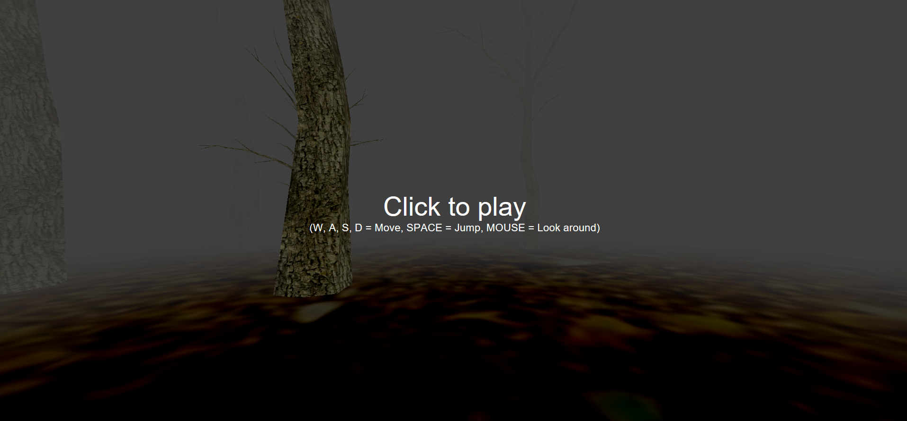
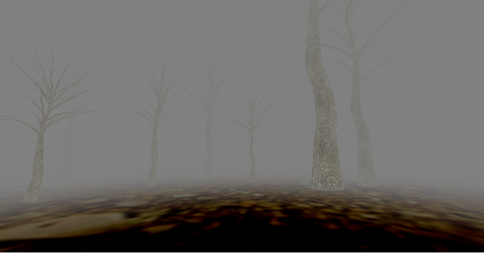
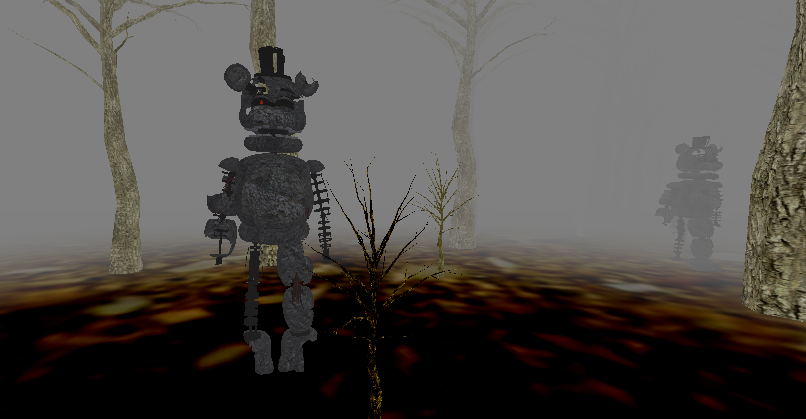

# SimpleHorrorGame
SimpleHorrorGame is a little website I wrote while trying to understanding three.js and WebGL. It's a really simple web horror game, which basically only allows you to walk in a really foggy forest and there's monster randomly poping out in the forest. 

This app is a fun side project I built within 3 days, as a learning process.

The key feature of the app is as following:

* PointerLockerControl is used for the user to walk and jump through the map;
* Fog effect is used to create a horror environment, also practice fog effect in fragment shader instead of just use Three.js fog;
* Trees' texture is applied using fragment shader to practice rendering process;
* Trees' location is generated randomly, so each time the forest is different;
* MonsterTime is updating monster location. Monster's texture used MTL file;

# Credits
* PointerLockerControl is adapted from mrdoob / http://mrdoob.com/
---
# Screenshots

